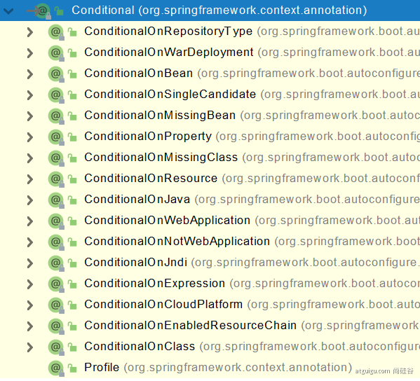

# 自动配置原理

## SpringBoot特色

### 依赖管理

- 父项目做依赖管理

  SpringBoot中几乎为我们声明了所有常见的 依赖，我们不再需要关注版本号，版本号由springBoot来给我们仲裁。

  ````xml
  依赖管理    
  <parent>
          <groupId>org.springframework.boot</groupId>
          <artifactId>spring-boot-starter-parent</artifactId>
          <version>2.3.4.RELEASE</version>
  </parent>
  
  他的父项目
   <parent>
      <groupId>org.springframework.boot</groupId>
      <artifactId>spring-boot-dependencies</artifactId>
      <version>2.3.4.RELEASE</version>
    </parent>
  
  几乎声明了所有开发中常用的依赖的版本号,自动版本仲裁机制
  ````

- 开发导入starter场景启动器

```xml
1、见到很多 spring-boot-starter-* ： *就某种场景
2、只要引入starter，这个场景的所有常规需要的依赖我们都自动引入
3、SpringBoot所有支持的场景
https://docs.spring.io/spring-boot/docs/current/reference/html/using-spring-boot.html#using-boot-starter
4、见到的  *-spring-boot-starter： 第三方为我们提供的简化开发的场景启动器。
5、所有场景启动器最底层的依赖
<dependency>
  <groupId>org.springframework.boot</groupId>
  <artifactId>spring-boot-starter</artifactId>
  <version>2.3.4.RELEASE</version>
  <scope>compile</scope>
</dependency>
```

- 修改默认版本号的方式

```xml
1、查看spring-boot-dependencies里面规定当前依赖的版本 用的 key。
2、在当前项目里面重写配置
<properties>
    <mysql.version>5.1.43</mysql.version>
</properties>
```

### 自动配置

- 自动配置了tomcat

```xml
<dependency>
    <groupId>org.springframework.boot</groupId>
    <artifactId>spring-boot-starter-tomcat</artifactId>
    <version>2.3.4.RELEASE</version>
    <scope>compile</scope>
</dependency>
```

- 自动配置好SpringMVC常用的组件，例如DispatchServlet，字符编码转换过滤器，视图解析器
- 默认包扫描，启动类所在包，可以用以下代码修改包扫描

````java
@SpringBootApplication(scanBasePackages="com.atguigu")
````

- 各种配置有默认值，可以统一通过application.properties来修改
- 按需加载自动配置项，starter引入大量的组件，只有引入某些场景才会开启。

## 容器，基本注解

**`@Configuration`**

这是容器类的注解，基本形式是：

````java
@Configuration(proxyBeanMethods = false)
public class MyConfig {
    @Bean
    public User user01() {
        User u = new User();
        u.setAge(11);
        u.setName("zhang");
        return u;
    }

    @Bean("abc")
    public User user02() {
        return new User(25,"liu");
    }
}
````

注意到`proxyBeanMethods`参数，这个还是挺重要的。

- FULL模式和LITE模式
    - FULL模式下，值为true，这时候会以代理的方式启动，代理内容是获取bean之前检查是否已经存在，保证bean为单例。
    - LITE模式下，值为false，这时获取bean直接新建，不需要额外的检查，主效率。
- 注意这两个模式并不影响全局bean的获取，只影响MyConfig对象获取bean的相关方法。

**组件基础注解**

````java
@Bean、@Component、@Controller、@Service、@Repository
````

其中bean的用法在1.2.1中展示。

**扫描和导入**

````java
@ComponentScan，常见包扫描注解
@Import，用于导入已有的class作为bean
````

**条件导入**



举例而言，`@ConditionalOnBean("a")`注解的类，只有在a存在时，才会注入。上述注解用于各种条件。

**原生配置文件引入**

可以在MyConfig类中引入xml已经配置好的bean吗？答案是可以的。

`@ImportResource`正是用于此。

**配置绑定**

可以绑定bean的属性，使用application.properties类似的配置文件来配置吗？答案是可以的。

```java
@Component // 扫描该bean
@ConfigurationProperties(prefix = "mycar") // 将该bean与properties文件绑定，并且用mycar.xxx来进行配置。
```

配置方式二

````java
// 在配置类例如MyConig中配置
@ConfigurationProperties(prefix = "mycar")
// 在启动类开启，为Car.class开启注解绑定，并且将Car注入
@EnableConfigurationProperties(Car.class)
````

## 启动类自动配置源码

```java

// 起点
@SpringBootApplication
public class MainApplication {}
//           ||
//           \/
// 展开是@Configuration的注解
// @Configuration
// public @interface SpringBootConfiguration 
@SpringBootConfiguration
// 核心注解 启动自动装配
@EnableAutoConfiguration
// 包扫描的注解
@ComponentScan(excludeFilters = { @Filter(type = FilterType.CUSTOM, classes = TypeExcludeFilter.class),
		@Filter(type = FilterType.CUSTOM, classes = AutoConfigurationExcludeFilter.class) })
public @interface SpringBootApplication {}
//           ||
//           \/
// 1. 这个注解实际上是找“Main所在的路径相关的包”
@AutoConfigurationPackage
// 2. 引入AutoConfigurationImportSelector的bean，该类会筛选所有的配置类，按需装载
@Import(AutoConfigurationImportSelector.class)
public @interface EnableAutoConfiguration {}
```

启动类的自动装配的核心注解为`@EnableAutoConfiguration`。实际上，主要完成装配各种配置类，这里主要关注SpringBoot的自动配置的底层设计，并不是具体装配的形式。

从上面代码来看，`@EnableAutoConfiguration`主要是干两件事。

- `@AutoConfigurationPackage`找“Main所在的路径相关的包”
- `@Import(AutoConfigurationImportSelector.class)`引入`AutoConfigurationImportSelector`的bean，该类会筛选所有的配置类，按需装载

### 包位置获取

- `@AutoConfigurationPackage`找“Main所在的路径相关的包”

````JAVA
// 1. @AutoConfigurationPackage寻找的包的过程如下
// @EnableAutoConfiguration -> AutoConfigurationPackage -> @Import(AutoConfigurationPackages.Registrar.class)
// 导入Registrar.class类
@Import(AutoConfigurationPackages.Registrar.class)
public @interface AutoConfigurationPackage {}
//  AutoConfigurationPackages.Registrar.class
static class Registrar implements ImportBeanDefinitionRegistrar, DeterminableImports {

	@Override
	public void registerBeanDefinitions(AnnotationMetadata metadata, BeanDefinitionRegistry registry) {
		// metadata是注解所在原始类（Main）的元信息，这里就是通过元信息获取所在包，并返回
		register(registry, new PackageImports(metadata).getPackageNames().toArray(new String[0]));
	}

	@Override
	public Set<Object> determineImports(AnnotationMetadata metadata) {
		return Collections.singleton(new PackageImports(metadata));
	}
}
````

### 加载配置类

- `@Import(AutoConfigurationImportSelector.class)`引入`AutoConfigurationImportSelector`的bean，该类会筛选所有的配置类，按需装载
    - `AutoConfigurationImportSelector`类中会调用`selectImports`=> `getAutoConfigurationEntry`
      => `getCandidateConfigurations`=>`loadSpringFactories`，`loadSpringFactories`
      最终会加载web项目中依赖的jar的`META-INF/spring.factories文件`，这些文件里记录了所有相关的配置类
    - `META-INF/spring.factories`最重要的是`spring-boot-autoconfigure`包下，一共包含128个配置类
    - 这里也是自动配置设计核心
        1. 全部检查已经写死的配置类
        2. 每个配置类按需加载，配置类的bean被注入的同时，会同时为context注入大量的相关的bean
        3. 自定义，以下详细展开
            - 配置类会加载相关的bean，经常会检查是否已经存在，存在则不加载，所以这里可以覆盖自定义bean
            - 配置类的具体设置，经常会绑定配置文件，可以通过配置文件来修改

加载配置类源码

```java
// 2. 引入AutoConfigurationImportSelector的bean，该类会筛选所有的配置类，按需装载
// @Import(AutoConfigurationImportSelector.class)
public class AutoConfigurationImportSelector implements DeferredImportSelector, BeanClassLoaderAware,
		ResourceLoaderAware, BeanFactoryAware, EnvironmentAware, Ordered {

	// 核心方法，改方法会返回所有应该加载的配置类
	@Override
	public String[] selectImports(AnnotationMetadata annotationMetadata) {
		if (!isEnabled(annotationMetadata)) {
			return NO_IMPORTS;
		}
		// 筛选并获取配置条目
		AutoConfigurationEntry autoConfigurationEntry = getAutoConfigurationEntry(annotationMetadata);
		return StringUtils.toStringArray(autoConfigurationEntry.getConfigurations());
	}
}

protected AutoConfigurationEntry getAutoConfigurationEntry(AnnotationMetadata annotationMetadata) {
	if (!isEnabled(annotationMetadata)) {
		return EMPTY_ENTRY;
	}
	AnnotationAttributes attributes = getAttributes(annotationMetadata);
	// 核心方法，获取相关配置类
	List<String> configurations = getCandidateConfigurations(annotationMetadata, attributes);
	configurations = removeDuplicates(configurations); // 去重，排除，删除，过滤等等操作
	Set<String> exclusions = getExclusions(annotationMetadata, attributes);
	checkExcludedClasses(configurations, exclusions);
	configurations.removeAll(exclusions);
	configurations = getConfigurationClassFilter().filter(configurations);
	fireAutoConfigurationImportEvents(configurations, exclusions);
	return new AutoConfigurationEntry(configurations, exclusions);
}
protected List<String> getCandidateConfigurations(AnnotationMetadata metadata, AnnotationAttributes attributes) {
	// 用工厂加载器加载
	List<String> configurations = SpringFactoriesLoader.loadFactoryNames(getSpringFactoriesLoaderFactoryClass(),
			getBeanClassLoader());
	Assert.notEmpty(configurations, "No auto configuration classes found in META-INF/spring.factories. If you "
			+ "are using a custom packaging, make sure that file is correct.");
	return configurations;
}
private static Map<String, List<String>> loadSpringFactories(@Nullable ClassLoader classLoader) {
	MultiValueMap<String, String> result = cache.get(classLoader);
	if (result != null) {
		return result;
	}

	try {
		// FACTORIES_RESOURCE_LOCATION的值为META-INF/spring.factories
		// 该方法将加载web项目中所有依赖jar中的META-INF/spring.factories文件
		// 检查所有的配置文件，配置类用于加载
		Enumeration<URL> urls = (classLoader != null ?
				classLoader.getResources(FACTORIES_RESOURCE_LOCATION) :
				ClassLoader.getSystemResources(FACTORIES_RESOURCE_LOCATION));
		result = new LinkedMultiValueMap<>();
		while (urls.hasMoreElements()) {
			URL url = urls.nextElement();
			UrlResource resource = new UrlResource(url);
			Properties properties = PropertiesLoaderUtils.loadProperties(resource);
			for (Map.Entry<?, ?> entry : properties.entrySet()) {
				String factoryTypeName = ((String) entry.getKey()).trim();
				for (String factoryImplementationName : StringUtils.commaDelimitedListToStringArray((String) entry.getValue())) {
					result.add(factoryTypeName, factoryImplementationName.trim());
				}
			}
		}
		cache.put(classLoader, result);
		return result;
	}
	catch (IOException ex) {
		throw new IllegalArgumentException("Unable to load factories from location [" +
				FACTORIES_RESOURCE_LOCATION + "]", ex);
	}
}
```

`spring-boot-autoconfigure`包下的文件`spring.factories`

````xml
org.springframework.boot.autoconfigure.EnableAutoConfiguration=\
org.springframework.boot.autoconfigure.admin.SpringApplicationAdminJmxAutoConfiguration,\
org.springframework.boot.autoconfigure.aop.AopAutoConfiguration,\
org.springframework.boot.autoconfigure.amqp.RabbitAutoConfiguration,\
org.springframework.boot.autoconfigure.batch.BatchAutoConfiguration,\
org.springframework.boot.autoconfigure.cache.CacheAutoConfiguration,\
org.springframework.boot.autoconfigure.cassandra.CassandraAutoConfiguration,\
org.springframework.boot.autoconfigure.context.ConfigurationPropertiesAutoConfiguration,\
org.springframework.boot.autoconfigure.context.LifecycleAutoConfiguration,\
org.springframework.boot.autoconfigure.context.MessageSourceAutoConfiguration,\
org.springframework.boot.autoconfigure.context.PropertyPlaceholderAutoConfiguration,\
org.springframework.boot.autoconfigure.couchbase.CouchbaseAutoConfiguration,\
org.springframework.boot.autoconfigure.dao.PersistenceExceptionTranslationAutoConfiguration,\
org.springframework.boot.autoconfigure.data.cassandra.CassandraDataAutoConfiguration,\
org.springframework.boot.autoconfigure.data.cassandra.CassandraReactiveDataAutoConfiguration,\
org.springframework.boot.autoconfigure.data.cassandra.CassandraReactiveRepositoriesAutoConfiguration,\
org.springframework.boot.autoconfigure.data.cassandra.CassandraRepositoriesAutoConfiguration,\
org.springframework.boot.autoconfigure.data.couchbase.CouchbaseDataAutoConfiguration,\
org.springframework.boot.autoconfigure.data.couchbase.CouchbaseReactiveDataAutoConfiguration,\
org.springframework.boot.autoconfigure.data.couchbase.CouchbaseReactiveRepositoriesAutoConfiguration,\
org.springframework.boot.autoconfigure.data.couchbase.CouchbaseRepositoriesAutoConfiguration,\
org.springframework.boot.autoconfigure.data.elasticsearch.ElasticsearchDataAutoConfiguration,\
org.springframework.boot.autoconfigure.data.elasticsearch.ElasticsearchRepositoriesAutoConfiguration,\
org.springframework.boot.autoconfigure.data.elasticsearch.ReactiveElasticsearchRepositoriesAutoConfiguration,\
org.springframework.boot.autoconfigure.data.elasticsearch.ReactiveElasticsearchRestClientAutoConfiguration,\
org.springframework.boot.autoconfigure.data.jdbc.JdbcRepositoriesAutoConfiguration,\
org.springframework.boot.autoconfigure.data.jpa.JpaRepositoriesAutoConfiguration,\
org.springframework.boot.autoconfigure.data.ldap.LdapRepositoriesAutoConfiguration,\
org.springframework.boot.autoconfigure.data.mongo.MongoDataAutoConfiguration,\
org.springframework.boot.autoconfigure.data.mongo.MongoReactiveDataAutoConfiguration,\
org.springframework.boot.autoconfigure.data.mongo.MongoReactiveRepositoriesAutoConfiguration,\
org.springframework.boot.autoconfigure.data.mongo.MongoRepositoriesAutoConfiguration,\
org.springframework.boot.autoconfigure.data.neo4j.Neo4jDataAutoConfiguration,\
org.springframework.boot.autoconfigure.data.neo4j.Neo4jRepositoriesAutoConfiguration,\
org.springframework.boot.autoconfigure.data.solr.SolrRepositoriesAutoConfiguration,\
org.springframework.boot.autoconfigure.data.r2dbc.R2dbcDataAutoConfiguration,\
org.springframework.boot.autoconfigure.data.r2dbc.R2dbcRepositoriesAutoConfiguration,\
org.springframework.boot.autoconfigure.data.r2dbc.R2dbcTransactionManagerAutoConfiguration,\
org.springframework.boot.autoconfigure.data.redis.RedisAutoConfiguration,\
org.springframework.boot.autoconfigure.data.redis.RedisReactiveAutoConfiguration,\
org.springframework.boot.autoconfigure.data.redis.RedisRepositoriesAutoConfiguration,\
org.springframework.boot.autoconfigure.data.rest.RepositoryRestMvcAutoConfiguration,\
org.springframework.boot.autoconfigure.data.web.SpringDataWebAutoConfiguration,\
org.springframework.boot.autoconfigure.elasticsearch.ElasticsearchRestClientAutoConfiguration,\
org.springframework.boot.autoconfigure.flyway.FlywayAutoConfiguration,\
org.springframework.boot.autoconfigure.freemarker.FreeMarkerAutoConfiguration,\
org.springframework.boot.autoconfigure.groovy.template.GroovyTemplateAutoConfiguration,\
org.springframework.boot.autoconfigure.gson.GsonAutoConfiguration,\
org.springframework.boot.autoconfigure.h2.H2ConsoleAutoConfiguration,\
org.springframework.boot.autoconfigure.hateoas.HypermediaAutoConfiguration,\
org.springframework.boot.autoconfigure.hazelcast.HazelcastAutoConfiguration,\
org.springframework.boot.autoconfigure.hazelcast.HazelcastJpaDependencyAutoConfiguration,\
org.springframework.boot.autoconfigure.http.HttpMessageConvertersAutoConfiguration,\
org.springframework.boot.autoconfigure.http.codec.CodecsAutoConfiguration,\
org.springframework.boot.autoconfigure.influx.InfluxDbAutoConfiguration,\
org.springframework.boot.autoconfigure.info.ProjectInfoAutoConfiguration,\
org.springframework.boot.autoconfigure.integration.IntegrationAutoConfiguration,\
org.springframework.boot.autoconfigure.jackson.JacksonAutoConfiguration,\
org.springframework.boot.autoconfigure.jdbc.DataSourceAutoConfiguration,\
org.springframework.boot.autoconfigure.jdbc.JdbcTemplateAutoConfiguration,\
org.springframework.boot.autoconfigure.jdbc.JndiDataSourceAutoConfiguration,\
org.springframework.boot.autoconfigure.jdbc.XADataSourceAutoConfiguration,\
org.springframework.boot.autoconfigure.jdbc.DataSourceTransactionManagerAutoConfiguration,\
org.springframework.boot.autoconfigure.jms.JmsAutoConfiguration,\
org.springframework.boot.autoconfigure.jmx.JmxAutoConfiguration,\
org.springframework.boot.autoconfigure.jms.JndiConnectionFactoryAutoConfiguration,\
org.springframework.boot.autoconfigure.jms.activemq.ActiveMQAutoConfiguration,\
org.springframework.boot.autoconfigure.jms.artemis.ArtemisAutoConfiguration,\
org.springframework.boot.autoconfigure.jersey.JerseyAutoConfiguration,\
org.springframework.boot.autoconfigure.jooq.JooqAutoConfiguration,\
org.springframework.boot.autoconfigure.jsonb.JsonbAutoConfiguration,\
org.springframework.boot.autoconfigure.kafka.KafkaAutoConfiguration,\
org.springframework.boot.autoconfigure.availability.ApplicationAvailabilityAutoConfiguration,\
org.springframework.boot.autoconfigure.ldap.embedded.EmbeddedLdapAutoConfiguration,\
org.springframework.boot.autoconfigure.ldap.LdapAutoConfiguration,\
org.springframework.boot.autoconfigure.liquibase.LiquibaseAutoConfiguration,\
org.springframework.boot.autoconfigure.mail.MailSenderAutoConfiguration,\
org.springframework.boot.autoconfigure.mail.MailSenderValidatorAutoConfiguration,\
org.springframework.boot.autoconfigure.mongo.embedded.EmbeddedMongoAutoConfiguration,\
org.springframework.boot.autoconfigure.mongo.MongoAutoConfiguration,\
org.springframework.boot.autoconfigure.mongo.MongoReactiveAutoConfiguration,\
org.springframework.boot.autoconfigure.mustache.MustacheAutoConfiguration,\
org.springframework.boot.autoconfigure.orm.jpa.HibernateJpaAutoConfiguration,\
org.springframework.boot.autoconfigure.quartz.QuartzAutoConfiguration,\
org.springframework.boot.autoconfigure.r2dbc.R2dbcAutoConfiguration,\
org.springframework.boot.autoconfigure.rsocket.RSocketMessagingAutoConfiguration,\
org.springframework.boot.autoconfigure.rsocket.RSocketRequesterAutoConfiguration,\
org.springframework.boot.autoconfigure.rsocket.RSocketServerAutoConfiguration,\
org.springframework.boot.autoconfigure.rsocket.RSocketStrategiesAutoConfiguration,\
org.springframework.boot.autoconfigure.security.servlet.SecurityAutoConfiguration,\
org.springframework.boot.autoconfigure.security.servlet.UserDetailsServiceAutoConfiguration,\
org.springframework.boot.autoconfigure.security.servlet.SecurityFilterAutoConfiguration,\
org.springframework.boot.autoconfigure.security.reactive.ReactiveSecurityAutoConfiguration,\
org.springframework.boot.autoconfigure.security.reactive.ReactiveUserDetailsServiceAutoConfiguration,\
org.springframework.boot.autoconfigure.security.rsocket.RSocketSecurityAutoConfiguration,\
org.springframework.boot.autoconfigure.security.saml2.Saml2RelyingPartyAutoConfiguration,\
org.springframework.boot.autoconfigure.sendgrid.SendGridAutoConfiguration,\
org.springframework.boot.autoconfigure.session.SessionAutoConfiguration,\
org.springframework.boot.autoconfigure.security.oauth2.client.servlet.OAuth2ClientAutoConfiguration,\
org.springframework.boot.autoconfigure.security.oauth2.client.reactive.ReactiveOAuth2ClientAutoConfiguration,\
org.springframework.boot.autoconfigure.security.oauth2.resource.servlet.OAuth2ResourceServerAutoConfiguration,\
org.springframework.boot.autoconfigure.security.oauth2.resource.reactive.ReactiveOAuth2ResourceServerAutoConfiguration,\
org.springframework.boot.autoconfigure.solr.SolrAutoConfiguration,\
org.springframework.boot.autoconfigure.task.TaskExecutionAutoConfiguration,\
org.springframework.boot.autoconfigure.task.TaskSchedulingAutoConfiguration,\
org.springframework.boot.autoconfigure.thymeleaf.ThymeleafAutoConfiguration,\
org.springframework.boot.autoconfigure.transaction.TransactionAutoConfiguration,\
org.springframework.boot.autoconfigure.transaction.jta.JtaAutoConfiguration,\
org.springframework.boot.autoconfigure.validation.ValidationAutoConfiguration,\
org.springframework.boot.autoconfigure.web.client.RestTemplateAutoConfiguration,\
org.springframework.boot.autoconfigure.web.embedded.EmbeddedWebServerFactoryCustomizerAutoConfiguration,\
org.springframework.boot.autoconfigure.web.reactive.HttpHandlerAutoConfiguration,\
org.springframework.boot.autoconfigure.web.reactive.ReactiveWebServerFactoryAutoConfiguration,\
org.springframework.boot.autoconfigure.web.reactive.WebFluxAutoConfiguration,\
org.springframework.boot.autoconfigure.web.reactive.error.ErrorWebFluxAutoConfiguration,\
org.springframework.boot.autoconfigure.web.reactive.function.client.ClientHttpConnectorAutoConfiguration,\
org.springframework.boot.autoconfigure.web.reactive.function.client.WebClientAutoConfiguration,\
org.springframework.boot.autoconfigure.web.servlet.DispatcherServletAutoConfiguration,\
org.springframework.boot.autoconfigure.web.servlet.ServletWebServerFactoryAutoConfiguration,\
org.springframework.boot.autoconfigure.web.servlet.error.ErrorMvcAutoConfiguration,\
org.springframework.boot.autoconfigure.web.servlet.HttpEncodingAutoConfiguration,\
org.springframework.boot.autoconfigure.web.servlet.MultipartAutoConfiguration,\
org.springframework.boot.autoconfigure.web.servlet.WebMvcAutoConfiguration,\
org.springframework.boot.autoconfigure.websocket.reactive.WebSocketReactiveAutoConfiguration,\
org.springframework.boot.autoconfigure.websocket.servlet.WebSocketServletAutoConfiguration,\
org.springframework.boot.autoconfigure.websocket.servlet.WebSocketMessagingAutoConfiguration,\
org.springframework.boot.autoconfigure.webservices.WebServicesAutoConfiguration,\
org.springframework.boot.autoconfigure.webservices.client.WebServiceTemplateAutoConfiguration
````

### 条件加载与自定义配置

从以下源码来看，自定义配置的方式有两种

- 自定义配置类相关的bean注入
- 修改配置文件

````java
// 配置类标注
@Configuration(proxyBeanMethods = false)
// 启用配置类绑定，加载ServerProperties的bean，见后续源码
@EnableConfigurationProperties(ServerProperties.class)
// 条件加载，当前应用为servlet菜加载
@ConditionalOnWebApplication(type = ConditionalOnWebApplication.Type.SERVLET)
// 条件加载，当类路径下存在CharacterEncodingFilter才加载，由于该类是web下的类，只要启用了web功能就会加载
@ConditionalOnClass(CharacterEncodingFilter.class)
// 条件加载，存在server.servlet.encoding = enabled时加载，默认存在
@ConditionalOnProperty(prefix = "server.servlet.encoding", value = "enabled", matchIfMissing = true)
public class HttpEncodingAutoConfiguration {

	private final Encoding properties;

	public HttpEncodingAutoConfiguration(ServerProperties properties) {
		this.properties = properties.getServlet().getEncoding();
	}

	// 注入CharacterEncodingFilter的bean对象
	@Bean
	// 重要条件注解，当不存在CharacterEncodingFilter才会加载
	// 这个的作用是，只要用户自定义注入了该类的bean对象，则不会加载，用于覆盖配置
	@ConditionalOnMissingBean
	public CharacterEncodingFilter characterEncodingFilter() {
		CharacterEncodingFilter filter = new OrderedCharacterEncodingFilter();
		filter.setEncoding(this.properties.getCharset().name());
		filter.setForceRequestEncoding(this.properties.shouldForce(Encoding.Type.REQUEST));
		filter.setForceResponseEncoding(this.properties.shouldForce(Encoding.Type.RESPONSE));
		return filter;
	}

	@Bean
	public LocaleCharsetMappingsCustomizer localeCharsetMappingsCustomizer() {
		return new LocaleCharsetMappingsCustomizer(this.properties);
	}

	static class LocaleCharsetMappingsCustomizer
			implements WebServerFactoryCustomizer<ConfigurableServletWebServerFactory>, Ordered {

		private final Encoding properties;

		LocaleCharsetMappingsCustomizer(Encoding properties) {
			this.properties = properties;
		}

		@Override
		public void customize(ConfigurableServletWebServerFactory factory) {
			if (this.properties.getMapping() != null) {
				factory.setLocaleCharsetMappings(this.properties.getMapping());
			}
		}

		@Override
		public int getOrder() {
			return 0;
		}

	}

}
// ServerProperties.class
// 指定绑定配置文件和配置的前缀
@ConfigurationProperties(prefix = "server", ignoreUnknownFields = true)
public class ServerProperties {

	/**
	 * Server HTTP port.
	 */
	private Integer port;

	/**
	 * Network address to which the server should bind.
	 */
	private InetAddress address;
}
````

## 开发技巧

### Lombok

```xml
<dependency>
    <groupId>org.projectlombok</groupId>
    <artifactId>lombok</artifactId>
</dependency>
```

简化bean的书写。

````java
@Data
@ToString
@EqualsAndHashCode
@NoArgsConstructor
@AllArgsConstructor
public class User {
    private int age;
    private String name;
}
````

### 热启动工具

````xml
<dependency>
    <groupId>org.springframework.boot</groupId>
    <artifactId>spring-boot-devtools</artifactId>
    <optional>true</optional>
</dependency>
````

`Ctrl+F9`刷新，其实是热重启

### 项目初始化工具Spring Initailizr

### Yaml配置文件的使用

#### 语法

一种比xml更加优秀的配置文件。

````java
@Data
public class Person {
    
    private String userName;
    private Boolean boss;
    private Date birth;
    private Integer age;
    private Pet pet;
    private String[] interests;
    private List<String> animal;
    private Map<String, Object> score;
    private Set<Double> salarys;
    private Map<String, List<Pet>> allPets;
}

@Data
public class Pet {
    private String name;
    private Double weight;
}
````

````yaml
# yaml表示以上对象
# 只允许使用空格缩进
# 属性使用kv对，kv之间保留空格
person:
  # 字符串不需要双引号
  userName: zhangsan
  boss: false
  # 时间表示
  birth: 2019/12/12 20:12:33
  age: 18
  pet: 
    name: tomcat
    weight: 23.4
  # 列表，行内表示
  interests: [篮球,游泳]
  # 列表，- 表示成员
  animal: 
    - jerry
    - mario
  # 对象嵌套
  score:
    english: 
      first: 30
      second: 40
      third: 50
    math: [131,140,148]
    # 字典
    chinese: {first: 128,second: 136}
  salarys: [3999,4999.98,5999.99]
  # private Map<String, List<Pet>> allPets;
  # 字典的另一种表示方式
  allPets:
    sick:
      - {name: tom}
      - {name: jerry,weight: 47}
    health: [{name: mario,weight: 47}]
````

#### 开启提示支持

````xml
# pom.xml
<dependency>
    <groupId>org.springframework.boot</groupId>
    <artifactId>spring-boot-configuration-processor</artifactId>
    <optional>true</optional>
</dependency>

# 排除打包，只在开发时使用
 <build>
        <plugins>
            <plugin>
                <groupId>org.springframework.boot</groupId>
                <artifactId>spring-boot-maven-plugin</artifactId>
                <configuration>
                    <excludes>
                        <exclude>
                            <groupId>org.springframework.boot</groupId>
                            <artifactId>spring-boot-configuration-processor</artifactId>
                        </exclude>
                    </excludes>
                </configuration>
            </plugin>
        </plugins>
    </build>
````

## **参考**

- 场景依赖 https://docs.spring.io/spring-boot/docs/current/reference/html/using-spring-boot.html#using-boot-starter
- `debug=true`可以查看那些配置类被成功启用
-
配置https://docs.spring.io/spring-boot/docs/current/reference/html/appendix-application-properties.html#common-application-properties

