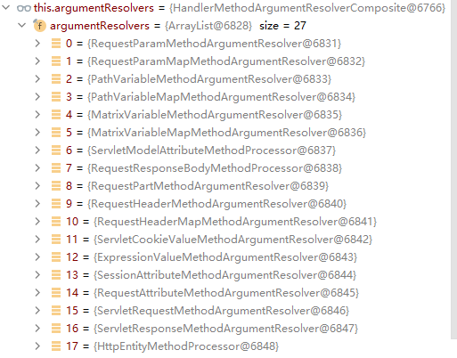

# Web开发

Spring Boot provides auto-configuration for Spring MVC that works well with most applications.

The auto-configuration adds the following features on top of Spring’s defaults:

- Inclusion of `ContentNegotiatingViewResolver` and `BeanNameViewResolver` beans.
- Support for serving static resources, including support for WebJars (covered [later in this document](https://docs.spring.io/spring-boot/docs/current/reference/html/spring-boot-features.html#boot-features-spring-mvc-static-content))).
- Automatic registration of `Converter`, `GenericConverter`, and `Formatter` beans.
- Support for `HttpMessageConverters` (covered [later in this document](https://docs.spring.io/spring-boot/docs/current/reference/html/spring-boot-features.html#boot-features-spring-mvc-message-converters)).
- Automatic registration of `MessageCodesResolver` (covered [later in this document](https://docs.spring.io/spring-boot/docs/current/reference/html/spring-boot-features.html#boot-features-spring-message-codes)).
- Static `index.html` support.
- Automatic use of a `ConfigurableWebBindingInitializer` bean (covered [later in this document](https://docs.spring.io/spring-boot/docs/current/reference/html/spring-boot-features.html#boot-features-spring-mvc-web-binding-initializer)).

自定义的三种方式。

If you want to keep those Spring Boot MVC customizations and make more [MVC customizations](https://docs.spring.io/spring/docs/5.3.6/reference/html/web.html#mvc) (interceptors, formatters, view controllers, and other features), you can add your own `@Configuration` class of type `WebMvcConfigurer` but **without** `@EnableWebMvc`.

If you want to provide custom instances of `RequestMappingHandlerMapping`, `RequestMappingHandlerAdapter`, or `ExceptionHandlerExceptionResolver`, and still keep the Spring Boot MVC customizations, you can declare a bean of type `WebMvcRegistrations` and use it to provide custom instances of those components.

If you want to take complete control of Spring MVC, you can add your own `@Configuration` annotated with `@EnableWebMvc`, or alternatively add your own `@Configuration`-annotated `DelegatingWebMvcConfiguration` as described in the Javadoc of `@EnableWebMvc`.

# 静态资源

## 基础使用

### 匹配机制

静态资源匹配，默认先找controller，找不到再找静态资源文件夹。

这个非常类似springMVC中的请求匹配原理

### 静态资源目录

默认 `/static` (or `/public` or `/resources` or `/META-INF/resources`

修改

````yaml
spring:
  resources:
    static-locations: [classpath:/test/]
````

### 静态资源访问前缀

由于底层匹配机制，如果web中包含大量的静态资源，那么所有请求都得去检查controller，这显然是没有必要的。为静态资源配置专用前缀，就是来解决这个问题，通过拦截器来过滤。

```yaml
spring:
  mvc:
    static-path-pattern: /res/**
```

### 欢迎页支持

- 静态资源路径下  index.html

- - 可以配置静态资源路径
  - 但是不可以配置静态资源的访问前缀。否则导致 index.html不能被默认访问

- controller能处理/index

### 自定义`Favicon`

favicon.ico 放在静态资源目录下即可。

## 静态资源配置源码解析

`@SpringBootApplication`底层回默认加载各种配置类，按需装载。再web应用场景下`WebMvcAutoConfiguration`负责web各种配置。

### 概述

加载WebMvcAutoConfiguration类

```java
@Configuration(proxyBeanMethods = false)
@ConditionalOnWebApplication(type = Type.SERVLET)
// 再web场景下，这些类会被加载
@ConditionalOnClass({ Servlet.class, DispatcherServlet.class, WebMvcConfigurer.class })
@ConditionalOnMissingBean(WebMvcConfigurationSupport.class)
// 指定加载优先级
@AutoConfigureOrder(Ordered.HIGHEST_PRECEDENCE + 10)
@AutoConfigureAfter({ DispatcherServletAutoConfiguration.class, TaskExecutionAutoConfiguration.class,
		ValidationAutoConfiguration.class })
public class WebMvcAutoConfiguration {}
```

该类包括多个配置子类`WebMvcAutoConfigurationAdapter`,`EnableWebMvcConfiguration`,`ResourceChainCustomizerConfiguration`。这些类注入的时候会使用有参的构造方法，其方法的参数将从context中获取。例如：

````java
public WebMvcAutoConfigurationAdapter(
    WebProperties webProperties, 
    WebMvcProperties mvcProperties,
    ListableBeanFactory beanFactory, 
    ObjectProvider<HttpMessageConverters> messageConvertersProvider,
    ObjectProvider<ResourceHandlerRegistrationCustomizer> resourceHandlerRegistrationCustomizerProvider,
    ObjectProvider<DispatcherServletPath> dispatcherServletPath,
    ObjectProvider<ServletRegistrationBean<?>> servletRegistrations) {
    this.mvcProperties = mvcProperties;
    this.beanFactory = beanFactory;
    this.messageConvertersProvider = messageConvertersProvider;
    this.resourceHandlerRegistrationCustomizer = resourceHandlerRegistrationCustomizerProvider.getIfAvailable();
    this.dispatcherServletPath = dispatcherServletPath;
    this.servletRegistrations = servletRegistrations;
    this.mvcProperties.checkConfiguration();
}
````

### 静态资源默认规则源码

我们配置过类似的属性用于设置静态资源的访问。这一部分来看看底层的实现方式。

````yaml
spring:
  mvc:
    static-path-pattern: /res/**
  web:
    resources:
      static-locations: [classpath:/test/]
````

````java

// 添加资源处理器
// @param ResourceHandlerRegistry是用于注册资源的管理器
protected void addResourceHandlers(ResourceHandlerRegistry registry) {
	// 将当前资源注册管理器添加到列表中
	super.addResourceHandlers(registry);
	// 是否映射静态请求，resourceProperties意味着可配置
	if (!this.resourceProperties.isAddMappings()) {
		logger.debug("Default resource handling disabled");
		return;
	}
	ServletContext servletContext = getServletContext();
	// 向registry中添加解析 "/webjars/**"的请求
	addResourceHandler(registry, "/webjars/**", "classpath:/META-INF/resources/webjars/");
	// 向registry中添加解析，我们配置的静态路径以及静态资源相关文件夹
	addResourceHandler(registry, this.mvcProperties.getStaticPathPattern(), (registration) -> {
		registration.addResourceLocations(this.resourceProperties.getStaticLocations());
		if (servletContext != null) {
			registration.addResourceLocations(new ServletContextResource(servletContext, SERVLET_LOCATION));
		}
	});
}
// 添加资源处理器的方法，最终都会调用如下重载方法
// @param Consumer是一个函数式接口
private void addResourceHandler(ResourceHandlerRegistry registry, String pattern,
		Consumer<ResourceHandlerRegistration> customizer) {
	if (registry.hasMappingForPattern(pattern)) {
		return;
	}
	// 将该pattern添加到注册管理器中，并且返回该pattern的一个注册实例registration
	ResourceHandlerRegistration registration = registry.addResourceHandler(pattern);
	// accept会调用Consummer的匿名lambda函数式接口，向registration添加location信息
	customizer.accept(registration);
	// 设置缓存时间，resourceProperties同样可配置
	registration.setCachePeriod(getSeconds(this.resourceProperties.getCache().getPeriod()));
	// 设置缓存
	registration.setCacheControl(this.resourceProperties.getCache().getCachecontrol().toHttpCacheControl());
	customizeResourceHandlerRegistration(registration);
}
````

### 欢迎页解析源码

SpringBoot欢迎页机制是：

- 加载静态资源中的index页面
- /index请求用handler进行处理

我们来看底层实现。

````java
// 返回了一个欢迎页面的handlerMapping
@Bean
public WelcomePageHandlerMapping welcomePageHandlerMapping(ApplicationContext applicationContext,
		FormattingConversionService mvcConversionService, ResourceUrlProvider mvcResourceUrlProvider) {
	// 新建了一个handlerMapping，getWelcomePage()获取欢迎页地址
	WelcomePageHandlerMapping welcomePageHandlerMapping = new WelcomePageHandlerMapping(
			new TemplateAvailabilityProviders(applicationContext), applicationContext, getWelcomePage(),
			this.mvcProperties.getStaticPathPattern());
	welcomePageHandlerMapping.setInterceptors(getInterceptors(mvcConversionService, mvcResourceUrlProvider));
	welcomePageHandlerMapping.setCorsConfigurations(getCorsConfigurations());
	return welcomePageHandlerMapping;
}
// 获得欢迎页
private Resource getWelcomePage() {
	// 遍历所有的静态资源地址，检查是否目录下有index.html页面
	for (String location : this.resourceProperties.getStaticLocations()) {
		Resource indexHtml = getIndexHtml(location);
		if (indexHtml != null) {
			return indexHtml;
		}
	}
	ServletContext servletContext = getServletContext();
	if (servletContext != null) {
		return getIndexHtml(new ServletContextResource(servletContext, SERVLET_LOCATION));
	}
	return null;
}

WelcomePageHandlerMapping(TemplateAvailabilityProviders templateAvailabilityProviders,
		ApplicationContext applicationContext, Resource welcomePage, String staticPathPattern) {
	// 当其实页面存在的时候，判断此时staticPathPattern的配置是否为默认，拦截/**
	// 是则确认index页面
	if (welcomePage != null && "/**".equals(staticPathPattern)) {
		logger.info("Adding welcome page: " + welcomePage);
		setRootViewName("forward:index.html");
	}
	// 否则尝试交给controller处理
	else if (welcomeTemplateExists(templateAvailabilityProviders, applicationContext)) {
		logger.info("Adding welcome page template: index");
		setRootViewName("index");
	}
}
````

# 请求

## 请求映射

### Rest风格请求的使用

客户端直接发送DELETE或PUT，可以正常映射。

在`SpringMVC`中，由于html页面form表单无法直接发送DELETE和PUT，因而需要手动配置过滤器。在`SpringBoot`中也一样。

在Web配置类`WebMvcAutoConfiguration`中，已有注入该过滤器的代码，不过需要手动启用。根据注解信息，很容易可以看出只需要配置`spring.mvc.hiddenmethod.filter = true`即可，该值默认为false。因为当前不管是客户端或是前后端分离的系统，都能正常发送各种Rest请求。

````java
@Bean
@ConditionalOnMissingBean(HiddenHttpMethodFilter.class)
@ConditionalOnProperty(prefix = "spring.mvc.hiddenmethod.filter", name = "enabled", matchIfMissing = false)
public OrderedHiddenHttpMethodFilter hiddenHttpMethodFilter() {
    return new OrderedHiddenHttpMethodFilter();
}
````

其原理也非常好理解：

- 表单提交会带上**_method=PUT**
- **请求过来被**HiddenHttpMethodFilter拦截

- - 请求是否正常，并且是POST

- - - 获取到**_method**的值。
    - 兼容以下请求；**PUT**.**DELETE**.**PATCH**
    - **原生request（post），包装模式requesWrapper重写了getMethod方法，返回的是传入的值。**
    - 过滤器链放行的时候用wrapper。以后的方法调用getMethod是调用requesWrapper的。

### 请求映射源码解析

该源码几乎就是`SpringMVC`的同款，可以参考`SpringMVC`的相关笔记，这里简单梳理。

#### Rest请求过滤器源码

过滤器原理非常简单

- 使用form隐藏表单提交"_method"字段，指示出提交的Rest请求类型

- 过滤器包装原生request，将方法与_method的字段绑定。

````java
@Override
protected void doFilterInternal(HttpServletRequest request, HttpServletResponse response, FilterChain filterChain)
		throws ServletException, IOException {

	HttpServletRequest requestToUse = request;

	if ("POST".equals(request.getMethod()) && request.getAttribute(WebUtils.ERROR_EXCEPTION_ATTRIBUTE) == null) {
		// 原生API获取请求参数，注意this.methodParam默认就是"_method"
		String paramValue = request.getParameter(this.methodParam);
		if (StringUtils.hasLength(paramValue)) {
			// 大小写不敏感
			String method = paramValue.toUpperCase(Locale.ENGLISH);
			if (ALLOWED_METHODS.contains(method)) {
				// * 包装原来的request，将原本的GET请求包装为paramValue
				requestToUse = new HttpMethodRequestWrapper(request, method);
			}
		}
	}

	filterChain.doFilter(requestToUse, response);
}
// * 包装类源码非常简单，装饰器设计模式，为原本对象添加其他行为
private static class HttpMethodRequestWrapper extends HttpServletRequestWrapper {
	private final String method;
	public HttpMethodRequestWrapper(HttpServletRequest request, String method) {
		super(request);
		// 修改原来方法
		this.method = method;
	}

	@Override
	public String getMethod() {
		return this.method;
	}
}
````

#### 执行方法，处理映射

和`SpringMVC`几乎一致，这里就不展开了，只简单的总结一下逻辑，请参考笔记 

https://github.com/KDL-in/SpringMVCLearning/blob/master/notes/springMVC_%E6%BA%90%E7%A0%81.md#%E6%96%B9%E6%B3%95%E6%89%A7%E8%A1%8C%E8%BF%87%E7%A8%8B

`doDispatch`执行逻辑

- 为请求匹配合适的handler，`SpringBoot`默认的handlers变为5个
- 为handler匹配合适的适配器，适配器设计模式
- 执行方法
	- 执行方法前需要一定的初始化工作，包括视图和数据的容器`ModelAndView`
	- 初始化`ModelAndView`，并且这个阶段会先执行`@ModelAttribute`注解的方法，用于先方法前的bean初始化工作
	- 执行方法
		- 获得参数，其中就包括了使用不同的参数解析器解析参数
		- 参数，返回值，方法meta信息，万事俱备，执行方法
		- 返回视图和数据的容器mv
	- 处理mv，跳转和渲染，这其中需要涉及到视图解析的过程

````java
// 处理请求的最终核心方法
protected void doDispatch(HttpServletRequest request, HttpServletResponse response) throws Exception {
	HttpServletRequest processedRequest = request;
	HandlerExecutionChain mappedHandler = null;
	boolean multipartRequestParsed = false;

	WebAsyncManager asyncManager = WebAsyncUtils.getAsyncManager(request);

	try {
		ModelAndView mv = null;
		Exception dispatchException = null;

		try {
			processedRequest = checkMultipart(request);
			multipartRequestParsed = (processedRequest != request);

			// 获得合适的mappedHandler
			mappedHandler = getHandler(processedRequest);
			if (mappedHandler == null) {
				noHandlerFound(processedRequest, response);
				return;
			}

			// 获得合适的Adapter
			HandlerAdapter ha = getHandlerAdapter(mappedHandler.getHandler());

			// Process last-modified header, if supported by the handler.
			String method = request.getMethod();
			boolean isGet = "GET".equals(method);
			if (isGet || "HEAD".equals(method)) {
				long lastModified = ha.getLastModified(request, mappedHandler.getHandler());
				if (new ServletWebRequest(request, response).checkNotModified(lastModified) && isGet) {
					return;
				}
			}

			if (!mappedHandler.applyPreHandle(processedRequest, response)) {
				return;
			}

			// 执行方法
			mv = ha.handle(processedRequest, response, mappedHandler.getHandler());

			if (asyncManager.isConcurrentHandlingStarted()) {
				return;
			}

			applyDefaultViewName(processedRequest, mv);
			mappedHandler.applyPostHandle(processedRequest, response, mv);
		}
		catch (Exception ex) {
			dispatchException = ex;
		}
		catch (Throwable err) {
			// As of 4.3, we're processing Errors thrown from handler methods as well,
			// making them available for @ExceptionHandler methods and other scenarios.
			dispatchException = new NestedServletException("Handler dispatch failed", err);
		}
		// 处理跳转，渲染页面
		processDispatchResult(processedRequest, response, mappedHandler, mv, dispatchException);
	}
	catch (Exception ex) {
		triggerAfterCompletion(processedRequest, response, mappedHandler, ex);
	}
	catch (Throwable err) {
		triggerAfterCompletion(processedRequest, response, mappedHandler,
				new NestedServletException("Handler processing failed", err));
	}
	finally {
		if (asyncManager.isConcurrentHandlingStarted()) {
			// Instead of postHandle and afterCompletion
			if (mappedHandler != null) {
				mappedHandler.applyAfterConcurrentHandlingStarted(processedRequest, response);
			}
		}
		else {
			// Clean up any resources used by a multipart request.
			if (multipartRequestParsed) {
				cleanupMultipart(processedRequest);
			}
		}
	}
}
````

## 普通参数与注解

### 注解

`@PathVariable`、`@RequestHeader`、`@ModelAttribute`、`@RequestParam`、`@MatrixVariable`、`@CookieValue`、`@RequestBody`

```java
@RestController
public class ParameterTestController {


    //  car/2/owner/zhangsan
    @GetMapping("/car/{id}/owner/{username}")
    public Map<String,Object> getCar(@PathVariable("id") Integer id,
                                     @PathVariable("username") String name,
                                     @PathVariable Map<String,String> pv,
                                     @RequestHeader("User-Agent") String userAgent,
                                     @RequestHeader Map<String,String> header,
                                     @RequestParam("age") Integer age,
                                     @RequestParam("inters") List<String> inters,
                                     @RequestParam Map<String,String> params,
                                     @CookieValue("_ga") String _ga,
                                     @CookieValue("_ga") Cookie cookie){


        Map<String,Object> map = new HashMap<>();

//        map.put("id",id);
//        map.put("name",name);
//        map.put("pv",pv);
//        map.put("userAgent",userAgent);
//        map.put("headers",header);
        map.put("age",age);
        map.put("inters",inters);
        map.put("params",params);
        map.put("_ga",_ga);
        System.out.println(cookie.getName()+"===>"+cookie.getValue());
        return map;
    }

	// 直接获得参数体
    @PostMapping("/save")
    public Map postMethod(@RequestBody String content){
        Map<String,Object> map = new HashMap<>();
        map.put("content",content);
        return map;
    }


    //1、语法： 请求路径：/cars/sell;low=34;brand=byd,audi,yd
    // sell之后带的数据都是所谓的矩阵变量
    //2、SpringBoot默认是禁用了矩阵变量的功能
    //      手动开启：原理。对于路径的处理。UrlPathHelper进行解析。
    //              removeSemicolonContent（移除分号内容）支持矩阵变量的
    //3、矩阵变量必须有url路径变量才能被解析
    @GetMapping("/cars/{path}")
    public Map carsSell(@MatrixVariable("low") Integer low,
                        @MatrixVariable("brand") List<String> brand,
                        @PathVariable("path") String path){
        Map<String,Object> map = new HashMap<>();

        map.put("low",low);
        map.put("brand",brand);
        map.put("path",path);
        return map;
    }

    // 多路径矩阵变量
    // /boss/1;age=20/2;age=10
    @GetMapping("/boss/{bossId}/{empId}")
    public Map boss(@MatrixVariable(value = "age",pathVar = "bossId") Integer bossAge,
                    @MatrixVariable(value = "age",pathVar = "empId") Integer empAge){
        Map<String,Object> map = new HashMap<>();

        map.put("bossAge",bossAge);
        map.put("empAge",empAge);
        return map;

    }

}
```

### 普通参数解析

#### 核心逻辑

- SpringBoot准备好了27中参数解析器，这些参数解析实现了各自的参数解析方法
- 获得所有参数签名，遍历解析器尝试解析参数

#### 源代码

调用链

```java
// DispatcherServlet::DispatcherServlet
mv = ha.handle(processedRequest, response, mappedHandler.getHandler());
// 调用方法，返回mv
mav = invokeHandlerMethod(request, response, handlerMethod);
// 初始化mv，调用方法
invocableMethod.invokeAndHandle(webRequest, mavContainer);
// 调用方法，返回值，封装mv
Object returnValue = invokeForRequest(webRequest, mavContainer, providedArgs);
// 解析获得多有参数
Object[] args = getMethodArgumentValues(request, mavContainer, providedArgs);
```

核心方法，其中获取所有参数签名和所有预备好的参数解析器如下：可以看到，总共包括27个参数解析器。




参数解析核心方法

````java
// 核心方法，解析参数，返回参数列表
protected Object[] getMethodArgumentValues(NativeWebRequest request, @Nullable ModelAndViewContainer mavContainer,
		Object... providedArgs) throws Exception {
	// 获得所有参数签名，主要是文本解析注解和方法定义文件
	MethodParameter[] parameters = getMethodParameters();

	if (ObjectUtils.isEmpty(parameters)) {
		return EMPTY_ARGS;
	}
	// 遍历所有参数，用适当的参数解析器进行解析
	Object[] args = new Object[parameters.length];
	for (int i = 0; i < parameters.length; i++) {
		MethodParameter parameter = parameters[i];
		parameter.initParameterNameDiscovery(this.parameterNameDiscoverer);
		// 这应该是处理@Nullable和默认值注解的
		args[i] = findProvidedArgument(parameter, providedArgs);
		if (args[i] != null) {
			continue;
		}
		// * 遍历解析器，查看是否支持当前参数解析，并将对应的参数解析器放入缓存
		if (!this.resolvers.supportsParameter(parameter)) {
			throw new IllegalStateException(formatArgumentError(parameter, "No suitable resolver"));
		}
		try {
			// * 取出对应参数解析器，解析参数
			args[i] = this.resolvers.resolveArgument(parameter, mavContainer, request, this.dataBinderFactory);
		}
		catch (Exception ex) {
			// Leave stack trace for later, exception may actually be resolved and handled...
			if (logger.isDebugEnabled()) {
				String exMsg = ex.getMessage();
				if (exMsg != null && !exMsg.contains(parameter.getExecutable().toGenericString())) {
					logger.debug(formatArgumentError(parameter, exMsg));
				}
			}
			throw ex;
		}
	}
	return args;
}

// 展开
// 遍历所有参数解析器，如果存在则支持
private HandlerMethodArgumentResolver getArgumentResolver(MethodParameter parameter) {
	// 尝试从缓存中获取
	HandlerMethodArgumentResolver result = this.argumentResolverCache.get(parameter);
	if (result == null) {
		// 遍历所有参数解析器
		for (HandlerMethodArgumentResolver resolver : this.argumentResolvers) {
			// 是否支持解析
			if (resolver.supportsParameter(parameter)) {
				result = resolver;
				// 加入缓存
				this.argumentResolverCache.put(parameter, result);
				break;
			}
		}
	}
	return result;
}
// 从缓存中取出参数解析器，调用参数解析方法
public Object resolveArgument(MethodParameter parameter, @Nullable ModelAndViewContainer mavContainer,
		NativeWebRequest webRequest, @Nullable WebDataBinderFactory binderFactory) throws Exception {

	HandlerMethodArgumentResolver resolver = getArgumentResolver(parameter);
	if (resolver == null) {
		throw new IllegalArgumentException("Unsupported parameter type [" +
				parameter.getParameterType().getName() + "]. supportsParameter should be called first.");
	}
	return resolver.resolveArgument(parameter, mavContainer, webRequest, binderFactory);
}

// 参数解析器接口
public interface HandlerMethodArgumentResolver {

	boolean supportsParameter(MethodParameter parameter);

	@Nullable
	Object resolveArgument(MethodParameter parameter, @Nullable ModelAndViewContainer mavContainer,
			NativeWebRequest webRequest, @Nullable WebDataBinderFactory binderFactory) throws Exception;

}
````


### Map和Model参数解析

在参数区域声明Map和Model最终都会被放到request域中。来看源代码验证。

````java
@GetMapping("/params")
public String testMapAndModel(Map<String, Object> map, Model model) {
    map.put("aint", 5);
    model.addAttribute("bstring", "iam");
    return "forward:/success";
}
````

在参数解析阶段，遍历参数解析器解析参数，实际返回的都是mav中的同一个`BindingAwareModelMap`。

在调用上述方法之后，会给该map写入数据，方法执行完封装成mav返回。

```java
// DispatcherServlet::doDispatch
// 处理mav，并处理跳转问题
processDispatchResult(processedRequest, response, mappedHandler, mv, dispatchException);
// 调用渲染
render(mv, request, response);
// 构建视图
view = resolveViewName(viewName, mv.getModelInternal(), locale, request);
// 调用视图渲染
view.render(mv.getModelInternal(), request, response);
// 核心方法，视图渲染方法
@Override
public void render(@Nullable Map<String, ?> model, HttpServletRequest request,
        HttpServletResponse response) throws Exception {

    if (logger.isDebugEnabled()) {
        logger.debug("View " + formatViewName() +
                ", model " + (model != null ? model : Collections.emptyMap()) +
                (this.staticAttributes.isEmpty() ? "" : ", static attributes " + this.staticAttributes));
    }
	// * 将请求里携带的map，路径参数，进行合并。
    Map<String, Object> mergedModel = createMergedOutputModel(model, request, response);
    prepareResponse(request, response);
    // * 渲染，处理所有参数
    renderMergedOutputModel(mergedModel, getRequestToExpose(request), response);
}


```

````java
// 合并参数
protected Map<String, Object> createMergedOutputModel(@Nullable Map<String, ?> model,
        HttpServletRequest request, HttpServletResponse response) {
	// 路径参数提取
    @SuppressWarnings("unchecked")
    Map<String, Object> pathVars = (this.exposePathVariables ?
            (Map<String, Object>) request.getAttribute(View.PATH_VARIABLES) : null);

    // 总map大小
    int size = this.staticAttributes.size();
    size += (model != null ? model.size() : 0);
    size += (pathVars != null ? pathVars.size() : 0);

    Map<String, Object> mergedModel = CollectionUtils.newLinkedHashMap(size);
    // 添加所有参数
    mergedModel.putAll(this.staticAttributes);
    if (pathVars != null) {
        mergedModel.putAll(pathVars);
    }
    if (model != null) {
        mergedModel.putAll(model);
    }

    // Expose RequestContext?
    if (this.requestContextAttribute != null) {
        mergedModel.put(this.requestContextAttribute, createRequestContext(request, response, mergedModel));
    }
	
    return mergedModel;
}

// 处理所有参数，渲染页面，处理跳转
protected void renderMergedOutputModel(
        Map<String, Object> model, HttpServletRequest request, HttpServletResponse response) throws Exception {

    // 暴露所有参数，实现也非常简单，遍历，全都put到request中即可
    exposeModelAsRequestAttributes(model, request);

    // Expose helpers as request attributes, if any.
    exposeHelpers(request);

    // Determine the path for the request dispatcher.
    String dispatcherPath = prepareForRendering(request, response);

    // Obtain a RequestDispatcher for the target resource (typically a JSP).
    RequestDispatcher rd = getRequestDispatcher(request, dispatcherPath);
    if (rd == null) {
        throw new ServletException("Could not get RequestDispatcher for [" + getUrl() +
                "]: Check that the corresponding file exists within your web application archive!");
    }

    // If already included or response already committed, perform include, else forward.
    if (useInclude(request, response)) {
        response.setContentType(getContentType());
        if (logger.isDebugEnabled()) {
            logger.debug("Including [" + getUrl() + "]");
        }
        rd.include(request, response);
    }

    else {
        // Note: The forwarded resource is supposed to determine the content type itself.
        if (logger.isDebugEnabled()) {
            logger.debug("Forwarding to [" + getUrl() + "]");
        }
        rd.forward(request, response);
    }
}
````

### POJO参数绑定

#### 绑定原理

为自定义bean类型适配的参数解析器为`SevletModelAttributeMethodProcessor`。

```java
// ModelAttributeMethodProcessor::resolveArgument
// 该解析器解析方法如下
public final Object resolveArgument(MethodParameter parameter, @Nullable ModelAndViewContainer mavContainer,
        NativeWebRequest webRequest, @Nullable WebDataBinderFactory binderFactory) throws Exception {

    Assert.state(mavContainer != null, "ModelAttributeMethodProcessor requires ModelAndViewContainer");
    Assert.state(binderFactory != null, "ModelAttributeMethodProcessor requires WebDataBinderFactory");
	// 获得自定义bean的id名
    String name = ModelFactory.getNameForParameter(parameter);
    // 以下是绑定已有对象部分
    ModelAttribute ann = parameter.getParameterAnnotation(ModelAttribute.class);
    if (ann != null) {
        mavContainer.setBinding(name, ann.binding());
    }

    Object attribute = null;
    BindingResult bindingResult = null;
	// 开始绑定
    if (mavContainer.containsAttribute(name)) {
        attribute = mavContainer.getModel().get(name);
    }
    else {
        // Create attribute instance
        try {
            // 创建自定义bean类型的空实例
            attribute = createAttribute(name, parameter, binderFactory, webRequest);
        }
        catch (BindException ex) {
            if (isBindExceptionRequired(parameter)) {
                // No BindingResult parameter -> fail with BindException
                throw ex;
            }
            // Otherwise, expose null/empty value and associated BindingResult
            if (parameter.getParameterType() == Optional.class) {
                attribute = Optional.empty();
            }
            else {
                attribute = ex.getTarget();
            }
            bindingResult = ex.getBindingResult();
        }
    }

    if (bindingResult == null) {
        // Bean property binding and validation;
        // 创建binder绑定器，binder中有124个自带的类型转换器，converters
        WebDataBinder binder = binderFactory.createBinder(webRequest, attribute, name);
        if (binder.getTarget() != null) {
            if (!mavContainer.isBindingDisabled(name)) {
                // 绑定属性，调用反射方法，结合converters绑定属性
                bindRequestParameters(binder, webRequest);
            }
            validateIfApplicable(binder, parameter);
            if (binder.getBindingResult().hasErrors() && isBindExceptionRequired(binder, parameter)) {
                throw new BindException(binder.getBindingResult());
            }
        }
        // Value type adaptation, also covering java.util.Optional
        if (!parameter.getParameterType().isInstance(attribute)) {
            attribute = binder.convertIfNecessary(binder.getTarget(), parameter.getParameterType(), parameter);
        }
        bindingResult = binder.getBindingResult();
    }

    // Add resolved attribute and BindingResult at the end of the model
    Map<String, Object> bindingResultModel = bindingResult.getModel();
    mavContainer.removeAttributes(bindingResultModel);
    mavContainer.addAllAttributes(bindingResultModel);

    return attribute;
}
```

binder对象具有的124个类型转化器如下：


#### 自定义converter

我们来看如何自定义converter对象。

在SpringBoot中修改底层组件，开头提供了三种方式，第一种就是通过给容器中配置`WebMvcConfigurer`组件来完成。

对于增加converter这个操作，只需实现addFormatters，往其中新增新的converter即可。

```java
@Configuration
public class WebConfig implements WebMvcConfigurer {
    @Override
    public void addFormatters(FormatterRegistry registry) {
        registry.addConverter(new Converter<String, Pet>() {
            @Override
            public Pet convert(String source) {
                if(!StringUtils.isEmpty(source)){
                    Pet pet = new Pet();
                    String[] split = source.split(",");
                    pet.setName(split[0]);
                    pet.setAge(Integer.parseInt(split[1]));
                    return pet;
                }
                return null;
            }
        });
    }
}
```

### 返回值处理

#### 核心逻辑

`@ResponseBody`声明之后，返回对象可以直接转换为`json`，那么底层是如何实现的？

- 执行方法，拿到返回值
- 找到合适的处理器`RequestResponseBodyMethodProcessor`处理返回值，该处理器用于处理`@ResponseBody`标注的返回值
  - 内容协商，浏览器能接收的类型和服务器能响应的类型，需要进行完全匹配，找到合适的类型
  - 遍历消息转换器，`MappingJackson2HttpMessageConverter`能够将对象转化为json
  - 执行转化

````java
public void invokeAndHandle(ServletWebRequest webRequest, ModelAndViewContainer mavContainer,
        Object... providedArgs) throws Exception {
	// 执行完controller方法，拿到返回值
    Object returnValue = invokeForRequest(webRequest, mavContainer, providedArgs);
    setResponseStatus(webRequest);

    if (returnValue == null) {
        if (isRequestNotModified(webRequest) || getResponseStatus() != null || mavContainer.isRequestHandled()) {
            disableContentCachingIfNecessary(webRequest);
            mavContainer.setRequestHandled(true);
            return;
        }
    }
    else if (StringUtils.hasText(getResponseStatusReason())) {
        mavContainer.setRequestHandled(true);
        return;
    }

    mavContainer.setRequestHandled(false);
    Assert.state(this.returnValueHandlers != null, "No return value handlers");
    try {
        // 处理返回值
        this.returnValueHandlers.handleReturnValue(
                returnValue, getReturnValueType(returnValue), mavContainer, webRequest);
    }
    catch (Exception ex) {
        if (logger.isTraceEnabled()) {
            logger.trace(formatErrorForReturnValue(returnValue), ex);
        }
        throw ex;
    }
}
@Override
public void handleReturnValue(@Nullable Object returnValue, MethodParameter returnType,
        ModelAndViewContainer mavContainer, NativeWebRequest webRequest) throws Exception {
	// 遍历处理器，由于注解了ResponseBody，RequestResponseBodyMethodProcessor可以处理
    HandlerMethodReturnValueHandler handler = selectHandler(returnValue, returnType);
    if (handler == null) {
        throw new IllegalArgumentException("Unknown return value type: " + returnType.getParameterType().getName());
    }
    // 调用处理器处理返回值
    handler.handleReturnValue(returnValue, returnType, mavContainer, webRequest);
}
````

```java
// 处理器的处理方法如下
protected <T> void writeWithMessageConverters(@Nullable T value, MethodParameter returnType,
    ServletServerHttpRequest inputMessage, ServletServerHttpResponse outputMessage)
    throws IOException, HttpMediaTypeNotAcceptableException, HttpMessageNotWritableException {

Object body;
Class<?> valueType;
Type targetType;
// 判断原来是否是字符串
if (value instanceof CharSequence) {
    body = value.toString();
    valueType = String.class;
    targetType = String.class;
}
else { // 否则
    body = value;
    valueType = getReturnValueType(body, returnType);
    targetType = GenericTypeResolver.resolveType(getGenericType(returnType), returnType.getContainingClass());
}
// 死否Resource返回值
if (isResourceType(value, returnType)) {
    outputMessage.getHeaders().set(HttpHeaders.ACCEPT_RANGES, "bytes");
    if (value != null && inputMessage.getHeaders().getFirst(HttpHeaders.RANGE) != null &&
            outputMessage.getServletResponse().getStatus() == 200) {
        Resource resource = (Resource) value;
        try {
            List<HttpRange> httpRanges = inputMessage.getHeaders().getRange();
            outputMessage.getServletResponse().setStatus(HttpStatus.PARTIAL_CONTENT.value());
            body = HttpRange.toResourceRegions(httpRanges, resource);
            valueType = body.getClass();
            targetType = RESOURCE_REGION_LIST_TYPE;
        }
        catch (IllegalArgumentException ex) {
            outputMessage.getHeaders().set(HttpHeaders.CONTENT_RANGE, "bytes */" + resource.contentLength());
            outputMessage.getServletResponse().setStatus(HttpStatus.REQUESTED_RANGE_NOT_SATISFIABLE.value());
        }
    }
}
// 转换json
MediaType selectedMediaType = null;
MediaType contentType = outputMessage.getHeaders().getContentType();
boolean isContentTypePreset = contentType != null && contentType.isConcrete();
if (isContentTypePreset) {
    if (logger.isDebugEnabled()) {
        logger.debug("Found 'Content-Type:" + contentType + "' in response");
    }
    selectedMediaType = contentType;
}
else {
    HttpServletRequest request = inputMessage.getServletRequest();
    List<MediaType> acceptableTypes;
    try {
        // 获得浏览器能够接受的协议
        acceptableTypes = getAcceptableMediaTypes(request);
    }
    catch (HttpMediaTypeNotAcceptableException ex) {
        int series = outputMessage.getServletResponse().getStatus() / 100;
        if (body == null || series == 4 || series == 5) {
            if (logger.isDebugEnabled()) {
                logger.debug("Ignoring error response content (if any). " + ex);
            }
            return;
        }
        throw ex;
    }
    // 获得服务端能够匹配的协议
    List<MediaType> producibleTypes = getProducibleMediaTypes(request, valueType, targetType);

    if (body != null && producibleTypes.isEmpty()) {
        throw new HttpMessageNotWritableException(
                "No converter found for return value of type: " + valueType);
    }
    List<MediaType> mediaTypesToUse = new ArrayList<>();
    // 内容协商过程，匹配浏览器和服务端兼容的协议
    for (MediaType requestedType : acceptableTypes) {
        for (MediaType producibleType : producibleTypes) {
            if (requestedType.isCompatibleWith(producibleType)) {
                mediaTypesToUse.add(getMostSpecificMediaType(requestedType, producibleType));
            }
        }
    }
    if (mediaTypesToUse.isEmpty()) {
        if (body != null) {
            throw new HttpMediaTypeNotAcceptableException(producibleTypes);
        }
        if (logger.isDebugEnabled()) {
            logger.debug("No match for " + acceptableTypes + ", supported: " + producibleTypes);
        }
        return;
    }

    MediaType.sortBySpecificityAndQuality(mediaTypesToUse);
	// 获得兼容类型
    for (MediaType mediaType : mediaTypesToUse) {
        if (mediaType.isConcrete()) {
            selectedMediaType = mediaType;
            break;
        }
        else if (mediaType.isPresentIn(ALL_APPLICATION_MEDIA_TYPES)) {
            selectedMediaType = MediaType.APPLICATION_OCTET_STREAM;
            break;
        }
    }

    if (logger.isDebugEnabled()) {
        logger.debug("Using '" + selectedMediaType + "', given " +
                acceptableTypes + " and supported " + producibleTypes);
    }
}

if (selectedMediaType != null) {
    selectedMediaType = selectedMediaType.removeQualityValue();
    // 遍历消息转换器，找到可以处理返回值转换的转换器，最终拿到MappingJackson2HttpMessageConverter
    for (HttpMessageConverter<?> converter : this.messageConverters) {
        GenericHttpMessageConverter genericConverter = (converter instanceof GenericHttpMessageConverter ?
                (GenericHttpMessageConverter<?>) converter : null);
        if (genericConverter != null ?
                ((GenericHttpMessageConverter) converter).canWrite(targetType, valueType, selectedMediaType) :
                converter.canWrite(valueType, selectedMediaType)) {
            body = getAdvice().beforeBodyWrite(body, returnType, selectedMediaType,
                    (Class<? extends HttpMessageConverter<?>>) converter.getClass(),
                    inputMessage, outputMessage);
            if (body != null) {
                Object theBody = body;
                LogFormatUtils.traceDebug(logger, traceOn ->
                        "Writing [" + LogFormatUtils.formatValue(theBody, !traceOn) + "]");
                addContentDispositionHeader(inputMessage, outputMessage);
                if (genericConverter != null) {
                    // 转化为json
                    genericConverter.write(body, targetType, selectedMediaType, outputMessage);
                }
                else {
                    ((HttpMessageConverter) converter).write(body, selectedMediaType, outputMessage);
                }
            }
            else {
                if (logger.isDebugEnabled()) {
                    logger.debug("Nothing to write: null body");
                }
            }
            return;
        }
    }
}

```

#### 内容协商机制

内容协商其实就是根据客户端接收能力不同，返回不同媒体类型的数据。如果是以前的设计，我们需要写不同方法，然后根据不同参数进行不同参数的返回。例如返回json或返回xml。在SpringBoot中，内容协商机制替我们完成了这个过程。

- 获取浏览器请求的类型（即浏览器支持的类型），请求会在accept字段标志可以接收的类型

````java
// 是由contentNegotiationManager负责的，它是一个列表，包含不同的获取方式，例如可以从参数获取
// 默认是从请求的accept字段中获取
// text/html,application/xhtml+xml,application/xml;q=0.9,image/webp,image/apng,*/*;q=0.8,application/signed-exchange;v=b3;q=0.9
this.contentNegotiationManager.resolveMediaTypes(new ServletWebRequest(request));
````

- 获取服务器端能响应的类型

```java
protected List<MediaType> getProducibleMediaTypes(
        HttpServletRequest request, Class<?> valueClass, @Nullable Type targetType) {
    Set<MediaType> mediaTypes =
            (Set<MediaType>) request.getAttribute(HandlerMapping.PRODUCIBLE_MEDIA_TYPES_ATTRIBUTE);
    if (!CollectionUtils.isEmpty(mediaTypes)) {
        return new ArrayList<>(mediaTypes);
    }
    List<MediaType> result = new ArrayList<>();
    // 遍历所有的messageConverters对象，添加所有能处理的转换器
    for (HttpMessageConverter<?> converter : this.messageConverters) {
        if (converter instanceof GenericHttpMessageConverter && targetType != null) {
            if (((GenericHttpMessageConverter<?>) converter).canWrite(targetType, valueClass, null)) {
                result.addAll(converter.getSupportedMediaTypes(valueClass));
            }
        }
        else if (converter.canWrite(valueClass, null)) {
            result.addAll(converter.getSupportedMediaTypes(valueClass));
        }
    }
    return (result.isEmpty() ? Collections.singletonList(MediaType.ALL) : result);
}
```

#### 自定义

自定义包括两个方面

- 用户通过浏览器的format参数，指定客户端需要的类型，例如我想让客户端就返回xml
- 用户自定义类型，例如ddd，再对应自定义ddd的消息转换器

**配置支持通过请求指定返回类型**

````yaml
spring:
  mvc:
    contentnegotiation:
      favor-parameter: true
````

配置之后，可以通过请求参数配置要求响应的类型

````java
http://localhost:8080/getperson?format=json
````

可以指定响应类型。

实际的底层是通过给上述的`contentNegotiationManager`底层注入一个参数的解析管理器，来指定客户端需要的类型。

请求类型确定了，还得对应加入对应类型的消息转换器。

**开启xml返回支持**

```xml
//pom文件中引入依赖，支持返回xml格式
<dependency>
    <groupId>com.fasterxml.jackson.dataformat</groupId>
    <artifactId>jackson-dataformat-xml</artifactId>
</dependency>
```

其底层是为`messageConverters`增加一个xml的转化器。通过转换器来修改服务器能返回的类型。

````java
// WebMvcAutoConfigurationAdapter的配置中，有一个配置消息转换器
public void configureMessageConverters(List<HttpMessageConverter<?>> converters) {
    this.messageConvertersProvider
            .ifAvailable((customConverters) -> converters.addAll(customConverters.getConverters()));
}
// 其初始化会检查是否加载了xml的相关包，如果加载则注入xml消息转换器
if (jackson2XmlPresent) {
    Jackson2ObjectMapperBuilder builder = Jackson2ObjectMapperBuilder.xml();
    if (this.applicationContext != null) {
        builder.applicationContext(this.applicationContext);
    }
    messageConverters.add(new MappingJackson2XmlHttpMessageConverter(builder.build()));
}
// 检查是否加载xml相关包
static{
  jackson2XmlPresent = ClassUtils.isPresent("com.fasterxml.jackson.dataformat.xml.XmlMapper", classLoader);   
}
````

**自定义请求类型和响应处理**

```java
// 自定义针对application/kdl的响应类型的处理转换器
public class KDLMassegeConvertor implements HttpMessageConverter<Person> {
    @Override
    public boolean canRead(Class clazz, MediaType mediaType) {
        return false;
    }

    @Override
    public boolean canWrite(Class clazz, MediaType mediaType) {
        return clazz.isAssignableFrom(Person.class);
    }

    @Override
    public List<MediaType> getSupportedMediaTypes() {
        return MediaType.parseMediaTypes("application/kdl");
    }

    @Override
    public Person read(Class<? extends Person> clazz, HttpInputMessage inputMessage) throws IOException, HttpMessageNotReadableException {
        return null;
    }

    @Override
    public void write(Person person, MediaType contentType, HttpOutputMessage outputMessage) throws IOException, HttpMessageNotWritableException {
        String s = person.getUserName() + "  " + person.getBirth();
        outputMessage.getBody().write(s.getBytes());
    }
}
```

对应的自定义请求的映射。

```java
public WebMvcConfigurer webMvcConfigurer(){
        return new WebMvcConfigurer() {

            /**
             * 自定义内容协商策略
             * @param configurer
             */
            @Override
            public void configureContentNegotiation(ContentNegotiationConfigurer configurer) {
                //Map<String, MediaType> mediaTypes
                Map<String, MediaType> mediaTypes = new HashMap<>();
                mediaTypes.put("json",MediaType.APPLICATION_JSON);
                mediaTypes.put("xml",MediaType.APPLICATION_XML);
                mediaTypes.put("gg",MediaType.parseMediaType("application/x-guigu"));
                //指定支持解析哪些参数对应的哪些媒体类型
                ParameterContentNegotiationStrategy parameterStrategy = new ParameterContentNegotiationStrategy(mediaTypes);
                HeaderContentNegotiationStrategy headeStrategy = new HeaderContentNegotiationStrategy();
                configurer.strategies(Arrays.asList(parameterStrategy,headeStrategy));
            }
 }
```


