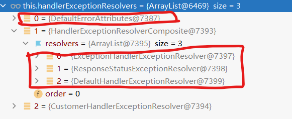

# 拦截器

## 使用

- 实现HandlerInterceptor接口

````java
public class LoginInterceptor implements HandlerInterceptor {
    @Override
    public boolean preHandle(HttpServletRequest request, HttpServletResponse response, Object handler) throws Exception {
        log.info("拦截path: {}", request.getRequestURL());
        Object user = request.getSession().getAttribute("user");
        if (user != null) return true;
        request.setAttribute("msg", "请先登录");
        request.getRequestDispatcher("/").forward(request, response);
        return false;
    }

    @Override
    public void postHandle(HttpServletRequest request, HttpServletResponse response, Object handler, ModelAndView modelAndView) throws Exception {
        log.info("postHandler执行");
    }

    @Override
    public void afterCompletion(HttpServletRequest request, HttpServletResponse response, Object handler, Exception ex) throws Exception {
        log.info("afterCompletion执行");
    }
}
````

- 添加拦截器

````java
@Configuration
public class MyConfig implements WebMvcConfigurer {
    @Override
    public void addInterceptors(InterceptorRegistry registry) {
        registry.addInterceptor(new LoginInterceptor())
                .addPathPatterns("/**")
                .excludePathPatterns("/login","/","/css/**", "/fonts/**", "/images/**", "/js/**");

    }
}
````

## 拦截器原理

基本和springMVC中的一致，以前做过源码分析。[拦截器](https://github.com/KDL-in/SpringMVCLearning/blob/master/notes/springMVC_功能.md#拦截器)

1、根据当前请求，找到**HandlerExecutionChain【**可以处理请求的handler以及handler的所有 拦截器】

2、先来**顺序执行** 所有拦截器的 preHandle方法

- 1、如果当前拦截器prehandler返回为true。则执行下一个拦截器的preHandle
- 2、如果当前拦截器返回为false。直接   倒序执行所有已经执行了的拦截器的  afterCompletion；

**3、如果任何一个拦截器返回false。直接跳出不执行目标方法**

**4、所有拦截器都返回True。执行目标方法**

**5、倒序执行所有拦截器的postHandle方法。**

**6、前面的步骤有任何异常都会直接倒序触发** afterCompletion

7、页面成功渲染完成以后，也会倒序触发 afterCompletion

ref：[05、Web开发 · 语雀 (yuque.com)](https://www.yuque.com/atguigu/springboot/vgzmgh#9EOYg)


# 异常机制

异常处理机制比较复杂，这里会先总结异常机制的四个方面，然后展开各个用法顺便及底层原理。

## SpringBoot异常机制

- `\error`机制 。它会将异常处理后，通常会将处理结果统一交给`/error`，由`BasicErrorController`等一系列默认处理组件负责处理。
  - 对于机器客户端，它返回JSON数据
  - 对于浏览器客户端，它返回HTML
  - 如果在`resource`目录下存在`/error/5xx.html`，`/error/4xx.html`，`/error/404.html`或其他状态码（`5xx`为模糊匹配），那么会自动转发请求到这些页面中
- 异常处理底层逻辑
  - 使用默认的异常处理器对异常进行处理，默认的异常处理器如下。
  - `DefaultErrorAttributes`负责记录异常信息
  - `HandlerExceptionResolverComposite`是官方提供的三个异常处理的组合
    - `ExceptionHandlerExcptionResolver`负责全局自定义异常catch类的解析
    - `ResponseStatusExcptionResovler`负责解析自定义异常和状态码
    - `DefaultHandlerExceptionResovler`负责解析一些常见的异常
- 自动配置类。`ErrorMvcAutoConfiguration`会为异常机制配置一系列默认类，当然这些类都可以自己替换。例如`DefaultErrorAttributes`负责记录错误状态。`BasicErrorController`负责处理`/error`请求。还有默认的异常视图解析器，默认空白页等等。
- 自定义。
  - 自定义错误页面，前面总结了，应该放在`/resource/error`下，以状态码或模糊匹配的状态码命名
  - 全局特定异常捕获。使用`@ControllerAdvice`,`@ExceptionHandler`自定义全局异常捕获类。可以指定全局catch的异常类型。
  - 自定义异常。继承`RuntimeException`实现自定义异常，使用`@ResponseStatus(value = HttpStatus.FORBIDDEN,reason = "too many users")`注解，自定义状态码和信息。
  - 自定义异常解析器。实现`HandlerExceptionResolver`接口，声明`@Component,@Order(value = Ordered.HIGHEST_PRECEDENCE)`将异常解析器注入。

## SpringBoot异常处理逻辑

````java
protected void doDispatch(HttpServletRequest request, HttpServletResponse response) throws Exception {

    try {

        try {

            // Determine handler for the current request.
            mappedHandler = getHandler(processedRequest);

            // Determine handler adapter for the current request.
            HandlerAdapter ha = getHandlerAdapter(mappedHandler.getHandler());

            // Actually invoke the handler.
            mv = ha.handle(processedRequest, response, mappedHandler.getHandler());

        }
        catch (Exception ex) {
            dispatchException = ex;
        }
        catch (Throwable err) {

            dispatchException = new NestedServletException("Handler dispatch failed", err);
        }
        // 处理方法运行结果，包括异常
        processDispatchResult(processedRequest, response, mappedHandler, mv, dispatchException);
    }
}
// 处理异常
mv = processHandlerException(request, response, handler, exception);
// 遍历异常处理器
if (this.handlerExceptionResolvers != null) {
    for (HandlerExceptionResolver resolver : this.handlerExceptionResolvers) {
        exMv = resolver.resolveException(request, response, handler, ex);
        if (exMv != null) {
            break;
        }
    }
}
````

默认的异常处理器有两个



- `DefaultErrorAttributes`负责记录异常信息
- `HandlerExceptionResolverComposite`是官方提供的三个异常处理的组合
  - `ExceptionHandlerExcptionResolver`负责全局自定义异常catch类的解析
  - `ResponseStatusExcptionResovler`负责解析自定义异常和状态码
  - `DefaultHandlerExceptionResovler`负责解析一些常见的异常

以`DefaultHandlerExceptionResovler`为例。底层源码做的事非常简单。

````java
protected ModelAndView doResolveException(
        HttpServletRequest request, HttpServletResponse response, @Nullable Object handler, Exception ex) {

    try {
        // 判断异常是否属于常见的异常，并处理
        if (ex instanceof HttpRequestMethodNotSupportedException) {
            return handleHttpRequestMethodNotSupported(
                    (HttpRequestMethodNotSupportedException) ex, request, response, handler);
        }
        else if (ex instanceof HttpMediaTypeNotSupportedException) {
            return handleHttpMediaTypeNotSupported(
                    (HttpMediaTypeNotSupportedException) ex, request, response, handler);
        }
        else if (ex instanceof HttpMediaTypeNotAcceptableException) {
            return handleHttpMediaTypeNotAcceptable(
                    (HttpMediaTypeNotAcceptableException) ex, request, response, handler);
        }
        else if (ex instanceof MissingPathVariableException) {
            return handleMissingPathVariable(
                    (MissingPathVariableException) ex, request, response, handler);
        }
        else if (ex instanceof MissingServletRequestParameterException) {
            return handleMissingServletRequestParameter(
                    (MissingServletRequestParameterException) ex, request, response, handler);
        }
        else if (ex instanceof ServletRequestBindingException) {
            return handleServletRequestBindingException(
                    (ServletRequestBindingException) ex, request, response, handler);
        }
        else if (ex instanceof ConversionNotSupportedException) {
            return handleConversionNotSupported(
                    (ConversionNotSupportedException) ex, request, response, handler);
        }
        else if (ex instanceof TypeMismatchException) {
            return handleTypeMismatch(
                    (TypeMismatchException) ex, request, response, handler);
        }
        else if (ex instanceof HttpMessageNotReadableException) {
            return handleHttpMessageNotReadable(
                    (HttpMessageNotReadableException) ex, request, response, handler);
        }
        else if (ex instanceof HttpMessageNotWritableException) {
            return handleHttpMessageNotWritable(
                    (HttpMessageNotWritableException) ex, request, response, handler);
        }
        else if (ex instanceof MethodArgumentNotValidException) {
            return handleMethodArgumentNotValidException(
                    (MethodArgumentNotValidException) ex, request, response, handler);
        }
        else if (ex instanceof MissingServletRequestPartException) {
            return handleMissingServletRequestPartException(
                    (MissingServletRequestPartException) ex, request, response, handler);
        }
        else if (ex instanceof BindException) {
            return handleBindException((BindException) ex, request, response, handler);
        }
        else if (ex instanceof NoHandlerFoundException) {
            return handleNoHandlerFoundException(
                    (NoHandlerFoundException) ex, request, response, handler);
        }
        else if (ex instanceof AsyncRequestTimeoutException) {
            return handleAsyncRequestTimeoutException(
                    (AsyncRequestTimeoutException) ex, request, response, handler);
        }
    }
    catch (Exception handlerEx) {
        if (logger.isWarnEnabled()) {
            logger.warn("Failure while trying to resolve exception [" + ex.getClass().getName() + "]", handlerEx);
        }
    }
    return null;
}
````

## 自动配置类

自动配置类给异常机制注入默认组件，例如

- `DefaultErrorAttributes`，负责记录错误状态信息
- `BasicErrorController`，`\error`请求的默认控制器
- `DefaultErrorViewResolverConfiguration`，错误视图解析器的配置文件，负责拼接找到资源目录下的自定义错误状态页
- `StaticView`空白页

````java

@Configuration(proxyBeanMethods = false)
@ConditionalOnWebApplication(type = Type.SERVLET)
@ConditionalOnClass({ Servlet.class, DispatcherServlet.class })
// Load before the main WebMvcAutoConfiguration so that the error View is available
@AutoConfigureBefore(WebMvcAutoConfiguration.class)
// 绑定配置
@EnableConfigurationProperties({ ServerProperties.class, WebMvcProperties.class })
public class ErrorMvcAutoConfiguration {

	private final ServerProperties serverProperties;

	public ErrorMvcAutoConfiguration(ServerProperties serverProperties) {
		this.serverProperties = serverProperties;
	}
    // DefaultErrorAttributes注入，负责记录异常状态信息
	@Bean
	@ConditionalOnMissingBean(value = ErrorAttributes.class, search = SearchStrategy.CURRENT)
	public DefaultErrorAttributes errorAttributes() {
		return new DefaultErrorAttributes();
	}
    // BasicErrorController负责处理\error请求
	@Bean
	@ConditionalOnMissingBean(value = ErrorController.class, search = SearchStrategy.CURRENT)
	public BasicErrorController basicErrorController(ErrorAttributes errorAttributes,
			ObjectProvider<ErrorViewResolver> errorViewResolvers) {
		return new BasicErrorController(errorAttributes, this.serverProperties.getError(),
				errorViewResolvers.orderedStream().collect(Collectors.toList()));
	}

	@Bean
	public ErrorPageCustomizer errorPageCustomizer(DispatcherServletPath dispatcherServletPath) {
		return new ErrorPageCustomizer(this.serverProperties, dispatcherServletPath);
	}

	@Bean
	public static PreserveErrorControllerTargetClassPostProcessor preserveErrorControllerTargetClassPostProcessor() {
		return new PreserveErrorControllerTargetClassPostProcessor();
	}
    // 默认的错误视图解析器
	@SuppressWarnings("deprecation")
	@Configuration(proxyBeanMethods = false)
	@EnableConfigurationProperties({ org.springframework.boot.autoconfigure.web.ResourceProperties.class,
			WebProperties.class, WebMvcProperties.class })
	static class DefaultErrorViewResolverConfiguration {

		private final ApplicationContext applicationContext;

		private final Resources resources;

		DefaultErrorViewResolverConfiguration(ApplicationContext applicationContext,
				org.springframework.boot.autoconfigure.web.ResourceProperties resourceProperties,
				WebProperties webProperties) {
			this.applicationContext = applicationContext;
			this.resources = webProperties.getResources().hasBeenCustomized() ? webProperties.getResources()
					: resourceProperties;
		}

		@Bean
		@ConditionalOnBean(DispatcherServlet.class)
		@ConditionalOnMissingBean(ErrorViewResolver.class)
		DefaultErrorViewResolver conventionErrorViewResolver() {
			return new DefaultErrorViewResolver(this.applicationContext, this.resources);
		}

	}
    // 默认空白页解析器
	@Configuration(proxyBeanMethods = false)
	@ConditionalOnProperty(prefix = "server.error.whitelabel", name = "enabled", matchIfMissing = true)
	@Conditional(ErrorTemplateMissingCondition.class)
	protected static class WhitelabelErrorViewConfiguration {

		private final StaticView defaultErrorView = new StaticView();

		@Bean(name = "error")
		@ConditionalOnMissingBean(name = "error")
		public View defaultErrorView() {
			return this.defaultErrorView;
		}

		// If the user adds @EnableWebMvc then the bean name view resolver from
		// WebMvcAutoConfiguration disappears, so add it back in to avoid disappointment.
		@Bean
		@ConditionalOnMissingBean
		public BeanNameViewResolver beanNameViewResolver() {
			BeanNameViewResolver resolver = new BeanNameViewResolver();
			resolver.setOrder(Ordered.LOWEST_PRECEDENCE - 10);
			return resolver;
		}

	}


	private static class ErrorTemplateMissingCondition extends SpringBootCondition {

		@Override
		public ConditionOutcome getMatchOutcome(ConditionContext context, AnnotatedTypeMetadata metadata) {
			ConditionMessage.Builder message = ConditionMessage.forCondition("ErrorTemplate Missing");
			TemplateAvailabilityProviders providers = new TemplateAvailabilityProviders(context.getClassLoader());
			TemplateAvailabilityProvider provider = providers.getProvider("error", context.getEnvironment(),
					context.getClassLoader(), context.getResourceLoader());
			if (provider != null) {
				return ConditionOutcome.noMatch(message.foundExactly("template from " + provider));
			}
			return ConditionOutcome.match(message.didNotFind("error template view").atAll());
		}

	}

    // 默认空白页
	private static class StaticView implements View {

		private static final MediaType TEXT_HTML_UTF8 = new MediaType("text", "html", StandardCharsets.UTF_8);

		private static final Log logger = LogFactory.getLog(StaticView.class);

		@Override
		public void render(Map<String, ?> model, HttpServletRequest request, HttpServletResponse response)
				throws Exception {
			if (response.isCommitted()) {
				String message = getMessage(model);
				logger.error(message);
				return;
			}
			response.setContentType(TEXT_HTML_UTF8.toString());
			StringBuilder builder = new StringBuilder();
			Object timestamp = model.get("timestamp");
			Object message = model.get("message");
			Object trace = model.get("trace");
			if (response.getContentType() == null) {
				response.setContentType(getContentType());
			}
			builder.append("<html><body><h1>Whitelabel Error Page</h1>").append(
					"<p>This application has no explicit mapping for /error, so you are seeing this as a fallback.</p>")
					.append("<div id='created'>").append(timestamp).append("</div>")
					.append("<div>There was an unexpected error (type=").append(htmlEscape(model.get("error")))
					.append(", status=").append(htmlEscape(model.get("status"))).append(").</div>");
			if (message != null) {
				builder.append("<div>").append(htmlEscape(message)).append("</div>");
			}
			if (trace != null) {
				builder.append("<div style='white-space:pre-wrap;'>").append(htmlEscape(trace)).append("</div>");
			}
			builder.append("</body></html>");
			response.getWriter().append(builder.toString());
		}

		private String htmlEscape(Object input) {
			return (input != null) ? HtmlUtils.htmlEscape(input.toString()) : null;
		}

		private String getMessage(Map<String, ?> model) {
			Object path = model.get("path");
			String message = "Cannot render error page for request [" + path + "]";
			if (model.get("message") != null) {
				message += " and exception [" + model.get("message") + "]";
			}
			message += " as the response has already been committed.";
			message += " As a result, the response may have the wrong status code.";
			return message;
		}

		@Override
		public String getContentType() {
			return "text/html";
		}

	}

	/**
	 * {@link WebServerFactoryCustomizer} that configures the server's error pages.
	 */
	static class ErrorPageCustomizer implements ErrorPageRegistrar, Ordered {

		private final ServerProperties properties;

		private final DispatcherServletPath dispatcherServletPath;

		protected ErrorPageCustomizer(ServerProperties properties, DispatcherServletPath dispatcherServletPath) {
			this.properties = properties;
			this.dispatcherServletPath = dispatcherServletPath;
		}

		@Override
		public void registerErrorPages(ErrorPageRegistry errorPageRegistry) {
			ErrorPage errorPage = new ErrorPage(
					this.dispatcherServletPath.getRelativePath(this.properties.getError().getPath()));
			errorPageRegistry.addErrorPages(errorPage);
		}

		@Override
		public int getOrder() {
			return 0;
		}

	}

	/**
	 * {@link BeanFactoryPostProcessor} to ensure that the target class of ErrorController
	 * MVC beans are preserved when using AOP.
	 */
	static class PreserveErrorControllerTargetClassPostProcessor implements BeanFactoryPostProcessor {

		@Override
		public void postProcessBeanFactory(ConfigurableListableBeanFactory beanFactory) throws BeansException {
			String[] errorControllerBeans = beanFactory.getBeanNamesForType(ErrorController.class, false, false);
			for (String errorControllerBean : errorControllerBeans) {
				try {
					beanFactory.getBeanDefinition(errorControllerBean)
							.setAttribute(AutoProxyUtils.PRESERVE_TARGET_CLASS_ATTRIBUTE, Boolean.TRUE);
				}
				catch (Throwable ex) {
					// Ignore
				}
			}
		}

	}

}
````

这些组件都比较好理解，以`BasicErrorController`为例，展开讲解这个组件的内部实现。

````java
@Controller
// 在properties中指定错误页路径
@RequestMapping("${server.error.path:${error.path:/error}}")
public class BasicErrorController extends AbstractErrorController {

	private final ErrorProperties errorProperties;

    // 浏览器请求，返回html页面
	@RequestMapping(produces = MediaType.TEXT_HTML_VALUE)
	public ModelAndView errorHtml(HttpServletRequest request, HttpServletResponse response) {
		HttpStatus status = getStatus(request);
		Map<String, Object> model = Collections
				.unmodifiableMap(getErrorAttributes(request, getErrorAttributeOptions(request, MediaType.TEXT_HTML)));
		response.setStatus(status.value());
        // 视图解析器解析自定义页面，如果存在
		ModelAndView modelAndView = resolveErrorView(request, response, status, model);
		return (modelAndView != null) ? modelAndView : new ModelAndView("error", model);
	}
    // 机器请求，返回json数据
	@RequestMapping
	public ResponseEntity<Map<String, Object>> error(HttpServletRequest request) {
		HttpStatus status = getStatus(request);
		if (status == HttpStatus.NO_CONTENT) {
			return new ResponseEntity<>(status);
		}
		Map<String, Object> body = getErrorAttributes(request, getErrorAttributeOptions(request, MediaType.ALL));
		return new ResponseEntity<>(body, status);
	}

}
````

## 自定义

异常定制，及底层的原理。

- 自定义错误页面，前面总结了，应该放在`/resource/error`下，以状态码或模糊匹配的状态码命名

  - 异常处理之后经常会转发给`/error`请求，在`doDispatch`方法中，会将拿到`BasicController#errorHtml`的方法

  ````java
  @RequestMapping(produces = MediaType.TEXT_HTML_VALUE)
  public ModelAndView errorHtml(HttpServletRequest request, HttpServletResponse response) {
      HttpStatus status = getStatus(request);
      Map<String, Object> model = Collections
              .unmodifiableMap(getErrorAttributes(request, getErrorAttributeOptions(request, MediaType.TEXT_HTML)));
      response.setStatus(status.value());
      // *调用默认视图解析器解析视图
      ModelAndView modelAndView = resolveErrorView(request, response, status, model);
      return (modelAndView != null) ? modelAndView : new ModelAndView("error", model);
  }
  // 调用默认视图解析器解析视图
  // 注意该视图解析器为DefaultErrorViewResovler，即在ErrorMvcAutoConfiguration自动配置的类，主要是做地址拼接，解析自定义错误页面
  protected ModelAndView resolveErrorView(HttpServletRequest request, HttpServletResponse response, HttpStatus status,
          Map<String, Object> model) {
      for (ErrorViewResolver resolver : this.errorViewResolvers) {
          ModelAndView modelAndView = resolver.resolveErrorView(request, status, model);
          if (modelAndView != null) {
              return modelAndView;
          }
      }
      return null;
  }
  ````

- 全局特定异常捕获。使用`@ControllerAdvice`,`@ExceptionHandler`自定义全局异常捕获类。可以指定全局catch的异常类型。
  - 该类异常处理由`ExceptionHandlerExceptionResolver`负责

````java
@Slf4j
@ControllerAdvice
public class GlobalException {
	// 将会全局捕获这两种异常
    @ExceptionHandler({ArithmeticException.class, NullPointerException.class})
    public String handleArithException(Exception exception) {
        log.error("异常是： {}", exception);
        return "login";
    }
}
// ExceptionHandlerExceptionResolver
// 获取自定义异常捕获方法
ServletInvocableHandlerMethod exceptionHandlerMethod = getExceptionHandlerMethod(handlerMethod, exception);

````

- 自定义异常。继承`RuntimeException`实现自定义异常，使用`@ResponseStatus(value = HttpStatus.FORBIDDEN,reason = "too many users")`注解，自定义状态码和信息。
  - 由`ResponseStatusExceptionResolver`负责处理

````java
@ResponseStatus(value = HttpStatus.FORBIDDEN,reason = "too many users")
public class UserTooManyException extends RuntimeException {
    public UserTooManyException() {

    }

    public UserTooManyException(String message) {
        super(message);
    }
}
//ResponseStatusExceptionResolver
protected ModelAndView doResolveException(
        HttpServletRequest request, HttpServletResponse response, @Nullable Object handler, Exception ex) {

    try {
        if (ex instanceof ResponseStatusException) {
            return resolveResponseStatusException((ResponseStatusException) ex, request, response, handler);
        }
		// 获得被ResponseStatus注解的异常的状态信息
        ResponseStatus status = AnnotatedElementUtils.findMergedAnnotation(ex.getClass(), ResponseStatus.class);
        if (status != null) {
            // 处理状态
            return resolveResponseStatus(status, request, response, handler, ex);
        }

        if (ex.getCause() instanceof Exception) {
            return doResolveException(request, response, handler, (Exception) ex.getCause());
        }
    }
    catch (Exception resolveEx) {
        if (logger.isWarnEnabled()) {
            logger.warn("Failure while trying to resolve exception [" + ex.getClass().getName() + "]", resolveEx);
        }
    }
    return null;
}
// 最终调用以下方法做异常转发，交给tomcat处理，实际上相当于/error
response.sendError(statusCode);
````

- 自定义异常解析器。实现`HandlerExceptionResolver`接口，声明`@Component,@Order(value = Ordered.HIGHEST_PRECEDENCE)`将异常解析器注入。
  - 在`processDispatchResult`方法中，调用异常解析器会加入自定义的异常解析器，按照优先级排列。

````java
@Component
@Order(value = Ordered.HIGHEST_PRECEDENCE)
public class CustomerHandlerExceptionResolver  implements HandlerExceptionResolver {
    @Override
    public ModelAndView resolveException(HttpServletRequest request, HttpServletResponse response, Object handler, Exception ex) {
        try {
            response.sendError(511, "我喜欢的异常解析器");
        } catch (IOException e) {
            e.printStackTrace();
        }

        return new ModelAndView();
    }
}

````

